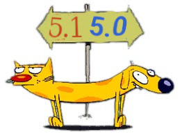

# Discovery v5 CATDOG

This is a frankenstein creation to help migrate Eth2 from disc v5.0 to v5.1.
Hacked together by @protolambda, based on discord discussion.

The bootnode code is based on [eth2-bootnode](https://github.com/protolambda/eth2-bootnode).

Have fun, this is not built for long-running usage, but should make migration more smooth.



Modifications to both discovery version copies:
- Strip out v4 files, no need to make it cat-dog-bird
- Watch for seen nodes, have the catdog copy it over to the other end
- Intercept revalidation, and make it try both v5.0 and v5.1 pings

And then there is the Catdog instance: same config etc., but two identities, two connections, and running both versions!
The common packages (ENR, enode, UDP connection, log, etc.) this uses the latest Geth as library (which just upgraded into v5.1).
For the actual discovery code of both versions, minimal copies are used instead.

## Usage

See `go run . --help`

```
Flags/args:
      --api-addr string            Address to bind HTTP API server to. API is disabled if empty. (default "0.0.0.0:8000")
      --attnets bytes8             Attnet bitfield, as bytes. (default 0000000000000000)
      --bootnodes-v50 strings      Optionally befriend other bootnodes
      --bootnodes-v51 strings      Optionally befriend other bootnodes
      --color                      Log with colors (default true)
      --enr-ip ip                  IP to put in ENR
      --enr-udp-v50 uint16         UDP port to put in v5.0 ENR
      --enr-udp-v51 uint16         UDP port to put in v5.1 ENR
      --fork-version bytes4        Eth2 fork version (default 00000000)
      --level string               Log level (default "debug")
      --listen-ip ip               Listen IP. (default 0.0.0.0)
      --listen-udp-v50 uint16      Listen UDP port for v5.0. Will try ENR port otherwise.
      --listen-udp-v51 uint16      Listen UDP port for v5.1. Will try ENR port otherwise.
      --node-db-v50 string         Path to dv5 node DB for v5.0. Memory DB if empty.
      --node-db-v51 string         Path to dv5 node DB for v5.1. Memory DB if empty.
      --priv-v50 P2P Private key   Private key for v5.0, in raw hex encoded format (default ? (no private key data))
      --priv-v51 P2P Private key   Private key for v5.1, in raw hex encoded format (default ? (no private key data))
```

## Docker

There's a docker image available here: [Docker](https://hub.docker.com/r/protolambda/discv5-catdog)
It is based on the `scratch` image, to run on some linux host.

## License

Most discovery code is a copy of that in go-ethereum. See COPYING file for details.
The rest is a temporary hack to help the discv5 protocol.
